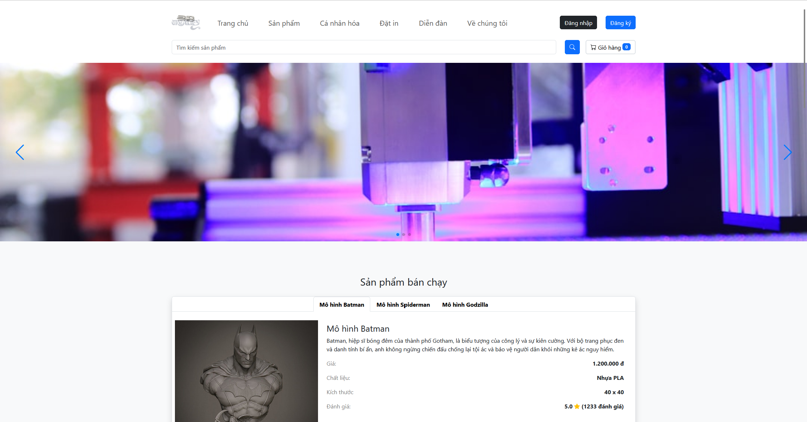
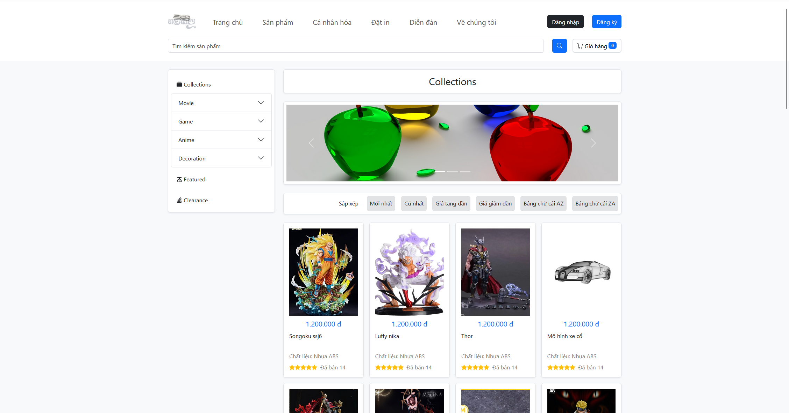
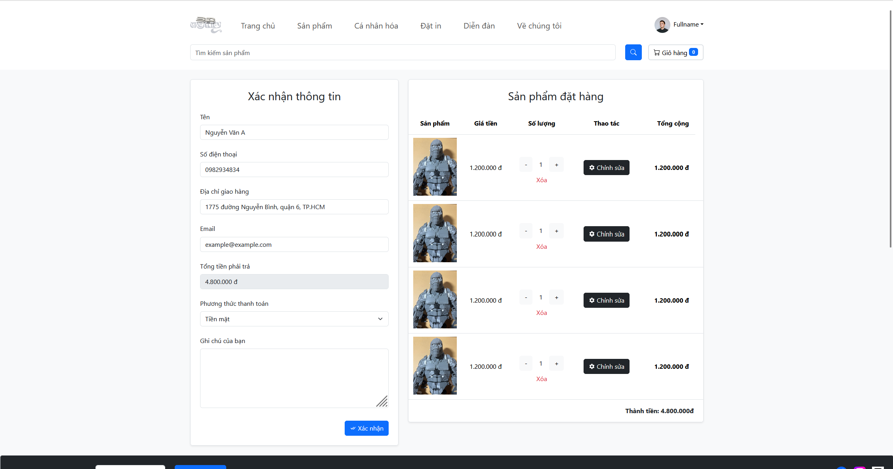

# 3D Creatify Prototype

Welcome to the 3D Creatify Prototype repository! This project is a static website built using Bootstrap for prototyping a 3D-related service or product website.

## Getting Started

To get started with this project, follow these steps:

### Prerequisites

- [Git](https://git-scm.com/)
- A web browser (e.g., Chrome, Firefox, Edge)

### Installation

1. Clone the repository:

   ```bash
   git clone https://github.com/votrongluan/3d-creatify-prototype
   cd 3d-creatify-prototype
   ```

2. Open the `index.html` file in your web browser to view the website.

## Usage

This project is a static prototype website. You can explore the various sections and features implemented using Bootstrap.

### Examples

Here are some example sections of the website:

- Homepage with a hero section
- About Us section
- Services offered
- Portfolio of 3D projects
- Contact form

## Screenshots

<div style="text-align: center;">
    
    <p><em>Screenshot 1</em></p>
</div>

<hr/>
<br/>

<div style="text-align: center;">
    
    <p><em>Screenshot 2</em></p>
</div>

<hr/>
<br/>

<div style="text-align: center;">
    
    <p><em>Screenshot 3</em></p>
</div>

<hr/>
<br/>

## Authors and Acknowledgment

Thanks to all the contributors who have helped develop this project.

## License

This project is licensed under the MIT License - see the [LICENSE](LICENSE) file for details.

## Project Status

**Not Actively Maintained**

Thank you for your interest in this project! Unfortunately, we regret to inform you that this project is no longer actively maintained. While contributions are always welcome, we recommend checking out other active projects or exploring alternative solutions.

If you have any questions or need further assistance, feel free to reach out. We appreciate your understanding and support!
